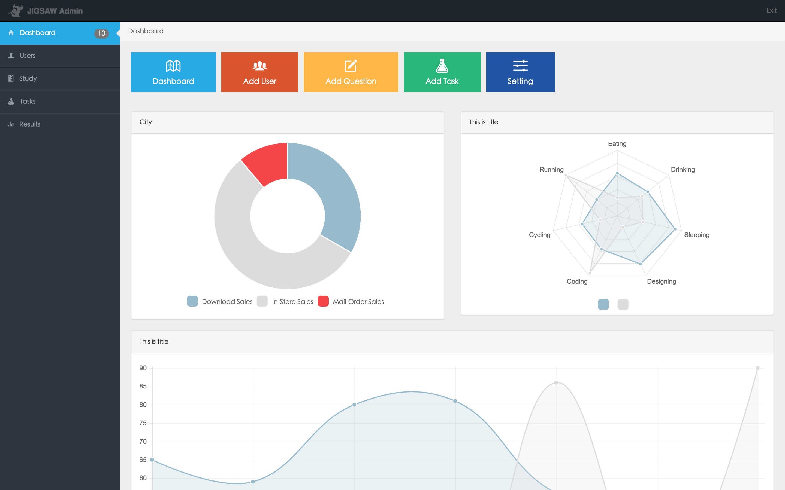

# Angular + WebPack + Babel
###screenshots

###run
```
npm install
npm run dev

http://localhost:8080
```
please make sure install webpack before run.


If have the following error message:
```
ERROR in ./src/module/controllers.jsModule not found: Error: Cannot resolve module 'chart.js' in e:***\jigsaw-admin\src\module @ ./src/module/controllers.js 3:0-19
```
please execute the command:
```
npm install chart.js
```
